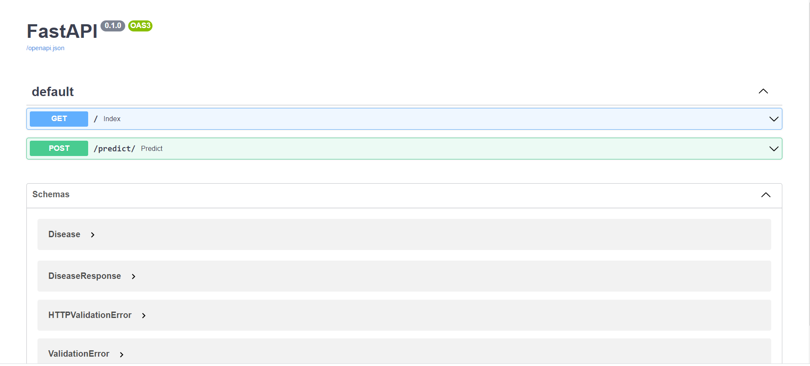
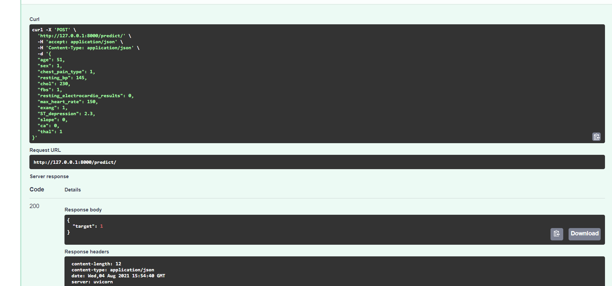

# Heart-Disease-Predictor


This is a model based Supervised Machine Learning. Tried Logistic Regression, SVC, KNN, 
Decision Tree and Random Forest for Classification of data so as to predict if the person 
with some features given have heart disease or not.
This is the accuracy for different Classifiers
```
The Score for  Logistic Regression is 0.8688524590163934
The Score for  SVC is 0.8852459016393442
The Score for  KNN is 0.9016393442622951
The Score for  Decision Tree Classifier is 0.8852459016393442
The Score for  Random Forest is 90.16
```
<br>


# Dataset 
[Download Dataset](https://www.kaggle.com/ronitf/heart-disease-uci)


## Requirements

Python 3.7+<br>
FastAPI<br>
Sklearn<br>
Uvicorn<br>
Pandas<br>
Heroku Cli

### Structure

```sh
├── model/Heart-Disease-Predictor        # machine learning model is here
├── model/model.pkl     # pickle file for random Forest Classifier
├── model/scale.pkl   # pickle file for Scaling Features
├── main.py            # API is here for ML Model
├── schemas.py       # schema of model
├── requirements.txt  # packages needed to install
```
# FastAPI

<p align="center">
  <a href="https://fastapi.tiangolo.com"></a>
</p>
<p align="center">
    <em>FastAPI framework, high performance, easy to learn, fast to code, ready for production</em>
</p>
<p align="center">
<a href="https://github.com/tiangolo/fastapi/actions?query=workflow%3ATest" target="_blank">

</a>
<a href="https://codecov.io/gh/tiangolo/fastapi" target="_blank">
    
</a>
<a href="https://pypi.org/project/fastapi" target="_blank">
    
</a>
</p>

---

**Documentation**: <a href="https://fastapi.tiangolo.com" target="_blank">https://fastapi.tiangolo.com</a>

**Source Code**: <a href="https://github.com/tiangolo/fastapi" target="_blank">https://github.com/tiangolo/fastapi</a>

---

FastAPI is a modern, fast (high-performance), web framework for building APIs with Python 3.6+ based on standard Python type hints.

The key features are:

* **Fast**: Very high performance, on par with **NodeJS** and **Go** (thanks to Starlette and Pydantic). [One of the fastest Python frameworks available](#performance).

* **Fast to code**: Increase the speed to develop features by about 200% to 300%. *
* **Fewer bugs**: Reduce about 40% of human (developer) induced errors. *
* **Intuitive**: Great editor support. <abbr title="also known as auto-complete, autocompletion, IntelliSense">Completion</abbr> everywhere. Less time debugging.
* **Easy**: Designed to be easy to use and learn. Less time reading docs.
* **Short**: Minimize code duplication. Multiple features from each parameter declaration. Fewer bugs.
* **Robust**: Get production-ready code. With automatic interactive documentation.
* **Standards-based**: Based on (and fully compatible with) the open standards for APIs: <a href="https://github.com/OAI/OpenAPI-Specification" class="external-link" target="_blank">OpenAPI</a> (previously known as Swagger) and <a href="https://json-schema.org/" class="external-link" target="_blank">JSON Schema</a>.

### Interactive API docs

Now go to <a href="http://127.0.0.1:8000/docs" class="external-link" target="_blank">http://127.0.0.1:8000/docs</a>.

You will see the automatic interactive API documentation (provided by <a href="https://github.com/swagger-api/swagger-ui" class="external-link" target="_blank">Swagger UI</a>):





Heroku CLI
==========


The Heroku CLI is used to manage Heroku apps from the command line. It is built using [oclif](https://oclif.io).

For more about Heroku see <https://www.heroku.com/home>

To get started see <https://devcenter.heroku.com/start>
[](https://heroku.com/deploy)

# To see the deployed API go to 
```https://spd-health.herokuapp.com/docs```

### Local Development / Testing /Contribution

1. Clone this repo.
2. `create virtualenv (your environment name)`
3. `pip install -r requirements.txt`
4. Make Changes
5. Create the Pull request
6. Wait for a day to get your changes merged if useful.
